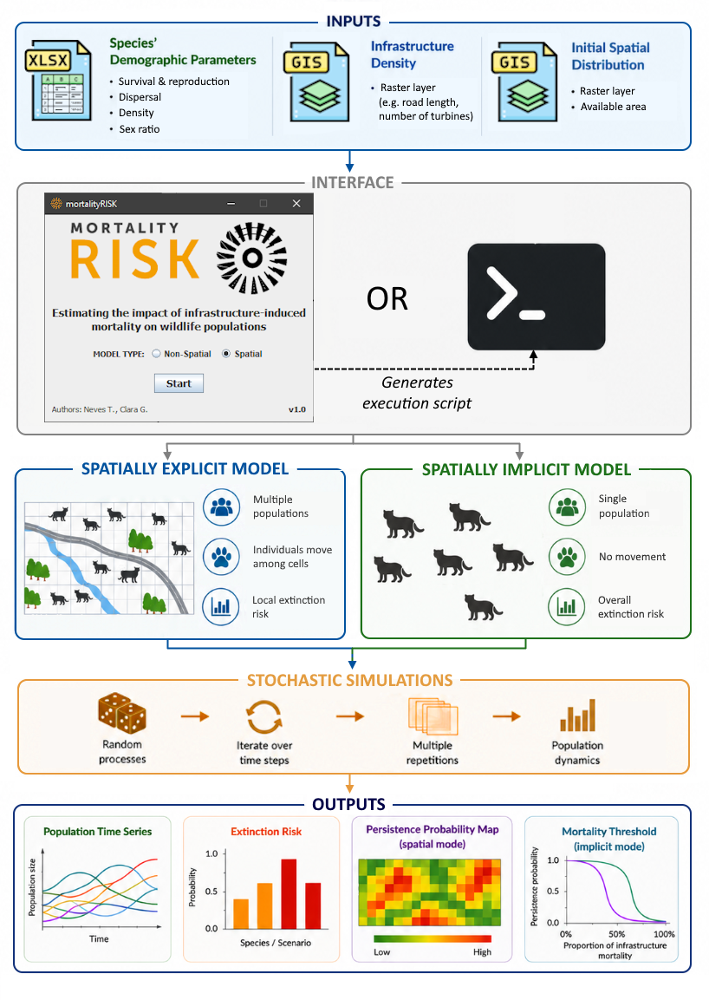

# A Spatially Explicit Tool for Evaluating Wildlife Population Responses to Infrastructure-Induced Mortality

[](https://opensource.org/licenses/MIT)

> [!IMPORTANT]
> ### Download the latest mortalityRISK release here!
> [](https://github.com/CodenameGreyFox/mortalityRISK/releases/latest)

**mortalityRISK** is an individual-based, multi-species, stochastic simulation framework built for Population Viability Analysis (PVA). It enables users to evaluate the long-term demographic and spatial consequences of infrastructure-induced wildlife mortality across roads, railways, power lines, and wind farms.  

The tool includes an accessible, user-friendly Graphical User Interface (GUI) and is implemented in Java utilizing multithreaded programming to guarantee robust computational efficiency.

---

## Key Features

* **Dual Modeling Modes:** Supports both **Spatially Explicit Mode** (incorporating grid-based metapopulation dynamics, and explicit animal dispersal) and **Spatially Implicit Mode** (assessing isolated populations for general demographic threshold analyses).
* **Empirical Data Integration:** Directly incorporates real-world mortality survey data and localized infrastructure density to compute safe biological thresholds.
* **Multi-Species Pipelines:** Simulates multiple species and alternative management or infrastructure development scenarios concurrently.
* **Reproducible Workflows:** Execute simulations visually through the point-and-click GUI or run command-line scripts automated by the tool's built-in command string exporter.

---

## Workflow Overview
<p align="center">

</p>

_Figure 1: Conceptual workflow of mortalityRISK, detailing required dataset inputs, internal interface processes, execution modes, and visual outputs._

---

## Getting Started

### Prerequisites
* **Java Runtime Environment (JRE):** Ensure Java 25 or higher is available on your machine to run the .jar file.

### Installation
 No installation required, navigate to your local folder and run the standalone application executable by either double clicking the .jar file or running:
```bash
   java -jar mortalityRISK.jar
```
Windows users can alternatively download the .zip file and, once extracted, run the executable file in the mortalityRISK folder. _This approach does not require Java._

---

## Input Data Requirements

The simulation utilizes two primary input components:

### 1. Demographic Spreadsheet (`.xlsx`)
A setup sheet declaring explicit demographic parameters. Key parameters include:
* **Infrastructure-Induced Mortality** (the actual observed mortality related to infrastructures)
* **Life Phases** & **Survival Rate** (supports variations across distinct life stages and sexes).
* **Longevity** & **Age at First Birth**.
* **Reproductive Metrics** 
* **Max Dispersal Length** & **Mate Finding Radius** (essential for spatial models).
  
  _A template for this file, as well as detailed explanation of each parameter, can be accessed through the GUI_

### 2. Georeferenced Spatial Layers (Spatially Explicit Mode Only)
* **Species Distribution Layer:** A .asc raster setting the target grid dimensions and identifying currently occupied or potential colonization areas.
* **Infrastructure Density Layer:** A .asc rasters identifying the infrastructure density in each cell (e.g., kilometers of roads, total wind turbine).
> [!TIP]
>A set of sample input files is available [here](https://github.com/CodenameGreyFox/mortalityRISK/tree/main/doc/Sample%20Input%20Files).
---

## Command Line Interface (CLI) Execution

`mortalityRISK` can be executed headlessly via the command line for automated scripting, cluster environments, or high-throughput batch processing. The arguments must be provided in a strict sequential order depending on your simulation environment.

It is recommended to use the `.jar` version for CLI operations. The `.exe` version will run as a background process and won't show any progress updates in the terminal.

_The command strings can be generated through the GUI._

### 1. Spatially Explicit Mode (12 Arguments)
When running a spatial simulation, provide the arguments in the following order:

```bash
java -jar mortalityRISK.jar <InputFile> <SpeciesFolder> <InfrastructureFile> <Iterations> <Repetitions> <ExtraScenarios> <MinPersistenceThreshold> <OutputFolder> <Cores> <InitialDate> <TimeUnit> <MaxProcessedIndividuals>
```

### 2. Spatially Implicit / Non-Spatial Mode (10 or 15 Arguments)

When running a non-spatial model, you can choose between a Single Run (10 arguments) or a Parameter Sweep Sensitivity Analysis (15 arguments).
**A. Single Run Configuration (10 Arguments)**
```bash
java -jar mortalityRISK.jar <InputFile> <InfrastructureDensity> <Iterations> <Repetitions> <ExtraScenarios> <OutputFolder> <Cores> <InitialDate> <TimeUnit> <MaxProcessedIndividuals>
```

**B. Senstivity Analysis Configuration (15 Arguments)**

To perform a sensitivity analysis, append the related values to the command:
```bash
java -jar mortalityRISK.jar <InputFile> <InfrastructureDensity> <Iterations> <Repetitions> <ExtraScenarios> <OutputFolder> <Cores> <InitialDate> <TimeUnit> <MaxProcessedIndividuals> <SweepInitialValue> <SweepFinalValue> <SweepInfrastructureMortality> <SweepResolution> <ScaleSweepMortalityToYearly>
```
---

> [!TIP]
> ### 📋 Model Parameter Guide
> For a comprehensive, detailed breakdown of all parameters in `mortalityRISK` and the CLI arguments, please refer to the **[Parameter Reference Guide](./doc/PARAMETERS.md)**.

---

## Exported Outputs

The program saves analytical tables and graphical visualizations out-of-the-box:
* **Population Time Series:** Clear CSV logs and data plots detailing total animal counts over time alongside 95% confidence intervals across stochastic iterations.
* **Overall Extinction Risk:** A comparative visual layout mapping species persistence levels across diverse infrastructure scenarios.
* **Persistence Map (`.asc` raster):** Cell-by-cell spatial grids mapping the probability that local subpopulations persist across simulation repetitions.
* **Mortality Threshold Graphs (Implicit Mode):** Sensitivity diagnostics pointing out the exact mortality boundaries that provoke abrupt population collapses.

---

## Authors

_Presently anonymised for reviewing purposes_

### Project Acknowledgements

_Presently anonymised for reviewing purposes_

---

## License

This project is licensed under the **MIT License**. You are free to modify, distribute, and implement this framework in downstream applications provided proper author attribution remains intact.

### Third-Party Java Libraries Bundled
* **Apache Commons, Log4j2, POI, XMLBeans** (Licensed under Apache License 2.0)
* **MigLayout** (Licensed under BSD 3-Clause License)
* **JFreeChart & JCommon** (Licensed under LGPL v2.1)

---

## Citation

When using `mortalityRISK` or citing the theoretical modeling framework, please reference our main article:

> _Presently anonymised for reviewing purposes_ (under review). mortalityRISK: a spatially explicit tool for evaluating wildlife population responses to infrastructure-induced mortality. _Methods In Ecology and Evolution_. 
